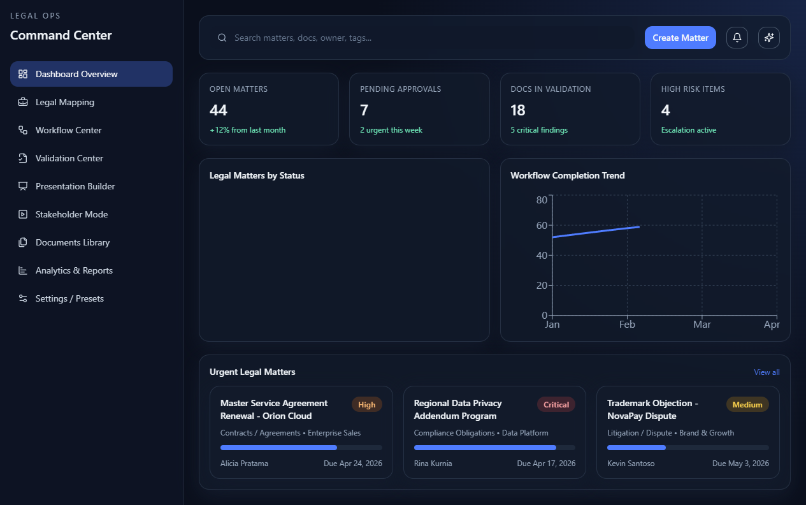
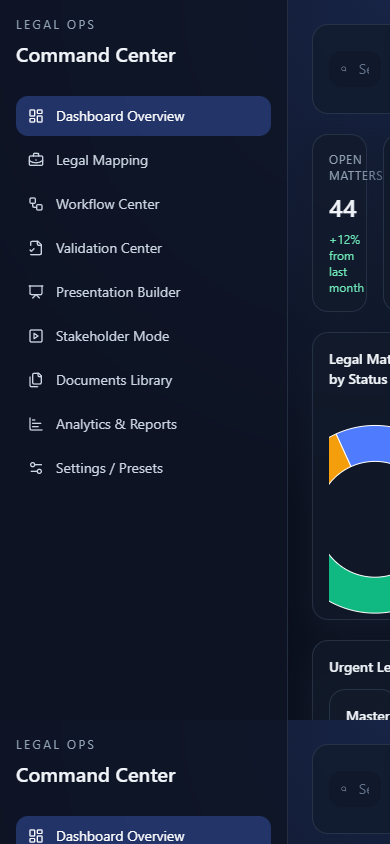

# Legal Command Center

Premium legal operations dashboard for matter tracking, document validation, workflow visibility, analytics, and stakeholder-ready presentation views.

## Product Focus

Legal Command Center is designed as an internal legal-tech workspace for teams that need a clear operating layer across active matters, documents, risk signals, validation checklists, and executive reporting.

## Preview



Mobile smoke check:



## Core Features

- Executive overview with legal KPIs
- Legal matter mapping and status indicators
- Workflow center for operational tracking
- Validation center for document and compliance checks
- Presentation builder and presentation mode
- Documents library
- Analytics and reporting views
- Settings and preset surfaces
- Matter drawer for detail inspection
- Centralized typed store and realistic mock data

## Tech Stack

- React 18
- TypeScript
- Vite
- Tailwind CSS
- Zustand
- Framer Motion
- Recharts
- Lucide React

## Architecture

- `src/App.tsx`: app shell, active view composition, transitions
- `src/app/router`: route/view definitions
- `src/components/layout`: sidebar and topbar
- `src/components/legal`: legal domain UI components
- `src/components/charts`: reusable reporting charts
- `src/components/shared`: reusable UI primitives
- `src/pages`: product modules
- `src/store`: centralized Zustand state
- `src/types`: legal domain model definitions
- `src/data`: realistic mock data

## Run Locally

```bash
npm install
npm run dev
```

## Useful Commands

```bash
npm run lint
npm run build
npm run preview
```

## Product Modules

1. Dashboard Overview
2. Legal Mapping
3. Workflow Center
4. Validation Center
5. Presentation Builder
6. Stakeholder Presentation Mode
7. Documents Library
8. Analytics and Reports
9. Settings and Presets

## Current Status

This repository is a standalone extraction candidate from the previous `Bro` workspace. It is suitable as a strong legal-tech portfolio base, but build, lint, and browser smoke testing still need to be completed before public promotion.

See `docs/REPOSITORY_STATUS.md` for the validation checklist.

## Roadmap

- Add API integration layer for real matters, documents, and validation events
- Add authentication, roles, and audit logging
- Add import/export workflows for documents and reports
- Add PDF/PPT export for stakeholder presentations
- Add advanced filters, search, saved views, and bulk actions
- Add test coverage for state transitions and high-risk UI flows
